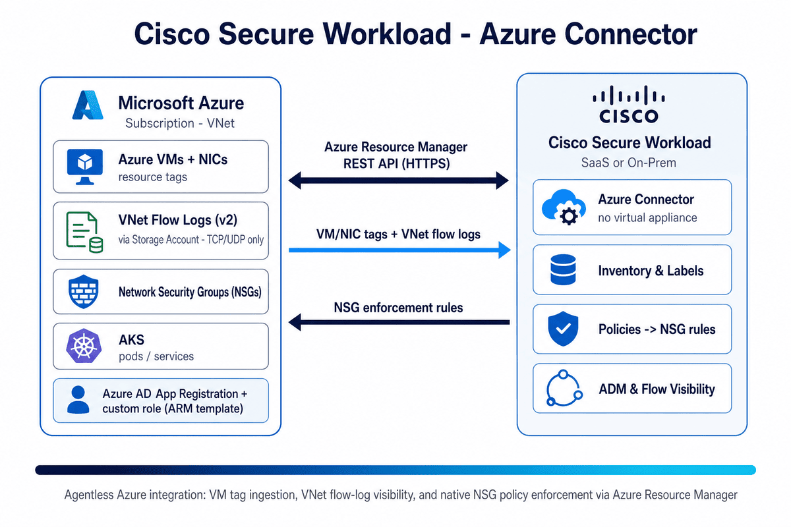

# Cisco Secure Workload → Azure Connector Guide

A step-by-step integration guide for the **Cisco Secure Workload (CSW) Azure connector** — an **agentless** cloud connector that ingests **Azure VM/NIC tags** as labels, streams **VNet flow logs** for ADM, and enforces segmentation natively through **Azure Network Security Groups (NSGs)**. CSW talks directly to the **Azure Resource Manager** APIs — **no virtual appliance required**.

[-0078D4?logo=microsoftazure&logoColor=white)](https://azure.microsoft.com/)

> **⚠ Disclaimer:** This is a **community reference guide** prepared by Cisco Solutions Engineering — not an official Cisco product document. Always refer to the [official Cisco Secure Workload documentation](https://www.cisco.com/c/en/us/support/security/tetration/series.html) and the [Compatibility Matrix](https://www.cisco.com/c/m/en_us/products/security/secure-workload-compatibility-matrix.html) for authoritative, up-to-date guidance.

---

## What This Covers

| Area | Detail |
|---|---|
| **Integration type** | **Agentless** Azure cloud connector — **no** Ingest/Edge virtual appliance (direct Azure Resource Manager API) |
| **Label ingestion** | Azure **VM + NIC tags** → CSW labels (real-time), across **multiple subscriptions** |
| **Flow visibility** | **VNet flow logs (Version 2)** pulled from an **Azure Storage Account** — **TCP/UDP only** (no ICMP, no TCP flags) |
| **Enforcement** | CSW policies → **NSG rules** on subnets/NICs (subnet NSG set to allow-all, interface NSGs owned by CSW) |
| **Containers** | **AKS** node/pod/service metadata |
| **Transport / auth** | HTTPS to **Azure Resource Manager**; **Azure AD App Registration** (client ID + secret/cert) with a least-privilege **custom role (ARM template)** |
| **Result** | Azure tags as labels, VNet flow ADM, and native NSG microsegmentation |
| **Verified against** | CSW 4.x on-prem and SaaS |

---

## Quick Start

### Prerequisites
- Azure **subscription ID** and an **Azure AD App Registration** (Application/Client ID, Tenant ID, client secret or certificate)
- The CSW-generated **ARM template** applied to grant the App Registration a least-privilege custom role
- (Flow logs) **VNet flow logs Version 2** enabled → **Azure Storage Account** with **storage account key access enabled**, reachable from the CSW cluster; **2+ day** retention
- (Segmentation) existing NSG rules backed up; enforcement-enabled workspace prepared first
- CSW cluster admin; target VRF/tenant configured; each **VNet belongs to exactly one** Azure connector

### Steps (summary)

**On Azure:**
1. Create an **App Registration** (single tenant); note Client ID + Tenant ID; create a client secret or upload a cert
2. Start the CSW connector wizard, download the **ARM template**, apply it (`az deployment sub create …`) to grant the custom role

**On Cisco Secure Workload:**
1. `Manage → Workloads → Connectors` → **Azure** → start the wizard
2. Enter Client ID, Tenant ID, Client Secret, Subscription ID → CSW discovers VNets
3. Per VNet: select **VM/NIC tags**, enable **Flow Log ingestion** (Storage Account), and — **only after** your workspace is enforcing — **Segmentation** → **Test and Apply**

**Verify:**
1. Connector page shows a recent per-VNet sync
2. Click a VNet → an **IP** → **Inventory Profile**; confirm Azure tags appear as labels
3. (Segmentation) check **Defend → Enforcement Status** and the CSW-managed NSG rules in Azure

See the [full step-by-step guide](CSW-Azure-Connector-Guide.md) or [open the HTML version](CSW-Azure-Connector-Guide.html) for detailed instructions.

---

## Video References

> **Legend:** 🎬 video · 📘 guide · 📄 doc

| Reference | What it shows |
|---|---|
| [🎬 CSW User Education video library](https://github.com/chandrapati/CSW-User-Education) | Curated Secure Workload concept explainers and walkthroughs |
| [📘 Azure Connector Guide](CSW-Azure-Connector-Guide.md) | This repo's full step-by-step deployment guide |
| [📄 Cisco docs — Azure Connector](https://www.cisco.com/c/en/us/td/docs/security/workload_security/secure_workload/user-guide/4_0/cisco-secure-workload-user-guide-on-prem-v40/configure-and-manage-connectors-for-secure-workload.html) | Authoritative connector behavior, capabilities, and limits |

---

## Architecture Diagram

*The agentless Azure connector reaches the Azure Resource Manager API to import VM/NIC tags as labels and pull VNet flow logs (via a Storage Account) for ADM, and — when enabled — programs Azure NSG rules from CSW policies for native, cloud-side enforcement.*

---

## Files in This Repo

| File | Description |
|---|---|
| [`README.md`](README.md) | This file — quick start and overview |
| [`CSW-Azure-Connector-Guide.md`](CSW-Azure-Connector-Guide.md) | Full step-by-step guide (Markdown source) |
| [`CSW-Azure-Connector-Guide.html`](CSW-Azure-Connector-Guide.html) | Styled HTML — open in browser for best experience |
| [`csw-azure-architecture.png`](csw-azure-architecture.png) | Architecture diagram |
| [`build.sh`](build.sh) | Regenerate HTML from Markdown (requires pandoc) |

---

## Capabilities & Labels — Quick Reference

| Azure source | CSW result |
|---|---|
| VM tag `Environment=Production` | label `Environment = Production` |
| NIC tags | merged with VM labels |
| VNet flow logs (v2) | flows for ADM & traffic visualization |
| AKS metadata | `pod/*`, `node/*`, `service/*` labels |
| CSW policy | **NSG** Allow/Deny rules on subnets/NICs |

> **Important:** Enable **Gather Labels + Flow Logs** first and enable the **workspace enforcement _before_** turning on **Segmentation** for a VNet — otherwise **all traffic on that VNet is allowed**. Enabling Segmentation **replaces existing NSG rules** (CSW auto-backs up the most recent state and restores it on disable; still take your own backup). Flow logs are **TCP/UDP only** — **no ICMP** and **no TCP flags**.

---

## Step-by-Step Guides

> **Legend:** 🎬 video · 📘 guide · 📄 doc

Hands-on integration and deployment guides — follow these top to bottom to build out a deployment:

| Guide | Description | Best for |
|-------|-------------|---------|
| [📘 Agent Installation](https://github.com/chandrapati/CSW-Agent-Installation-Guide) | Deploy CSW agents on Linux / Windows / cloud | Day-1 sensor deployment |
| [📘 Policy Lifecycle](https://github.com/chandrapati/CSW-Policy-Lifecycle) | Policy discovery → enforcement workflow | Policy management |
| [📘 ISE / pxGrid](https://github.com/chandrapati/csw-ise-integration) | ISE/pxGrid: user-identity–aware microsegmentation | Identity & Zero Trust |
| [📘 AnyConnect NVM](https://github.com/chandrapati/csw-anyconnect-nvm) | Endpoint process flows + user identity via NVM | Endpoint telemetry |
| [📘 ServiceNow CMDB](https://github.com/chandrapati/csw-servicenow-integration) | ServiceNow CMDB label enrichment for workload scopes | CMDB-driven policy |
| [📘 Infoblox](https://github.com/chandrapati/csw-infoblox-integration) | Infoblox IPAM/DNS extensible-attribute label enrichment | IPAM/DNS-driven policy |
| [📘 F5 BIG-IP](https://github.com/chandrapati/csw-f5-integration) | F5 virtual-server labels, policy enforcement, IPFIX flow visibility | Load balancer segmentation |
| [📘 NetScaler ADC](https://github.com/chandrapati/csw-netscaler-integration) | NetScaler LB virtual-server labels, ACL enforcement + AppFlow/IPFIX flow visibility | Load balancer segmentation |
| [📘 AWS Connector](https://github.com/chandrapati/csw-aws-connector) | EC2 tag ingestion + VPC flow logs + Security Group enforcement | AWS workloads |
| [📘 Azure Connector](https://github.com/chandrapati/csw-azure-connector) | Azure VM tag ingestion + VNet flow logs + NSG enforcement | Azure workloads |
| [📘 GCP Connector](https://github.com/chandrapati/csw-gcp-connector) | GCE label ingestion + VPC flow logs + firewall enforcement | GCP workloads |
| [📘 NetFlow](https://github.com/chandrapati/csw-netflow-integration) | NetFlow v9/IPFIX agentless flow ingestion from switches | Network fabric visibility |
| [📘 ERSPAN](https://github.com/chandrapati/csw-erspan-integration) | Agentless packet mirroring for legacy / OT / IoT devices | Deep agentless visibility |
| [📘 Secure Firewall](https://github.com/chandrapati/CSW-Secure-Firewall-Integration-Guide) | NSEL flow ingestion from Cisco Secure Firewall (FTD/ASA) | Firewall flow visibility |
| [📘 Splunk Integration](https://github.com/chandrapati/csw-splunk-integration) | CSW syslog alerts → Splunk SIEM | SecOps / SIEM teams |

## Resources

> **Legend:** 🎬 video · 📘 guide · 📄 doc

Learning paths, reference material, and day-2 tooling:

| Resource | Description | Best for |
|----------|-------------|---------|
| [📘 User Education](https://github.com/chandrapati/CSW-User-Education) | Onboarding guides, concept explainers, and curated video library | New CSW users |
| [📘 Compliance Mapping](https://github.com/chandrapati/CSW-Compliance-Mapping) | Map CSW controls to NIST, PCI-DSS, HIPAA, CIS | Compliance & audit |
| [📘 Tenant Insights](https://github.com/chandrapati/CSW-Tenant-Insights) | Tenant-level reporting and analytics | Visibility metrics |
| [📘 Operations Toolkit](https://github.com/chandrapati/CSW-Operations-Toolkit) | Day-2 ops scripts: health checks, reporting, policy analysis | Ongoing operations |
| [📄 Supported OS & Compatibility Matrix](https://www.cisco.com/c/m/en_us/products/security/secure-workload-compatibility-matrix.html) | Cisco's authoritative list of supported agent operating systems, external systems, and connector requirements | Platform planning & prerequisites |

> **Suggested customer journey:**
> User Education → Agent Installation → Policy Lifecycle → ISE/pxGrid → ServiceNow CMDB → Infoblox → F5 BIG-IP → NetScaler ADC → Splunk Integration → Compliance Mapping → Operations Toolkit
